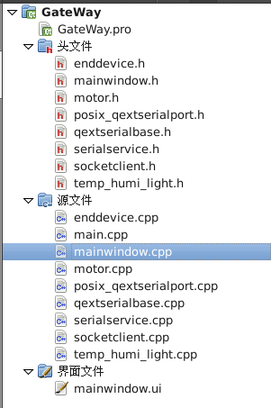
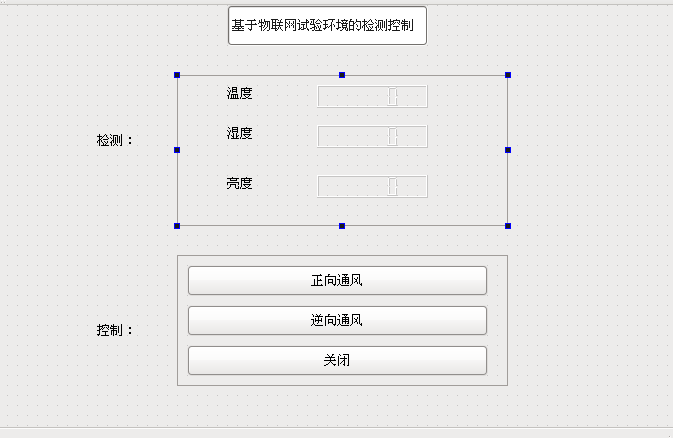

# 简单 WSN 网关系统
《嵌入式软件》课程设计，基于物联网试验环境的温湿度实时显示系统。  
在物联网试验箱上实现一个温湿度显示系统，系统上电启动后自动启动此程序。每隔2秒自动刷新温湿度数据。温湿度数据从物联网试验箱自带的温湿度传感器获取。温湿度显示界面采用QT编程技术实现。  
还有一个简陋的Java的Socket服务器展示端：[KVgateway_testsocket](https://github.com/KevinBetterQ/KVgateway_testsocket)

## 相关环境
- 开发语言：Qt
- 支持平台：嵌入式Linux系统，ARM gcc
- 相关技术：计时器、串口读写、信号和槽、QTcpSocket类

## 工程介绍  
Qt工程：创建工程，新建8个.h文件。9个.cpp文件、一个.ui文件。包含串口的封装、界面展示、温湿度更新、电机控制、socket通信。

- 借助开源的串口通信和调试代码qextserialbase和posix_qtextserialport，封装serialservice类，包含串口的初始化，数据写入，读取，关闭等操作。
- tem_humi_light.cpp进行温湿度的计算与设置。
- 工程中添加了motor类，表示电机的控制，不仅仅可以通过串口进行数据的获取，也可以通过串口进行数据的写入，从而实现电机的开关控制。
- mainwindow.cpp中包含所有的ui控件的初始化，各种控件的更新操作，串口的打开，数据的读取与写入函数的封装实现。同时定义定时器定时获取串口的数据并更新界面。
- socketclient类定义QTcpSocket，作为socket的客户端，并设置IP与端口进行连接，并封装实现readmsg()和sendmsg()函数进行数据的发送与接收。

## 编译和安装指南
交叉编译程序：  
1. 代码完成后，用命令行窗口进入工程目录下，执行qmake-arm，产生makefile文件。
2. 编译：make，产生可执行文件Gateway（如果之前已经编译过一次，需要先make clean）

## 效果展示

## Authors
qiwenkaikai@qq.com